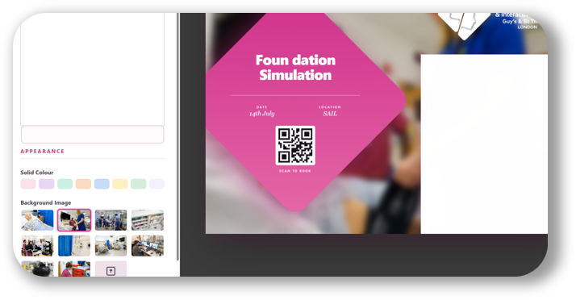

	

# FlyerGen

FlyerGen is a small browser-based tool for creating event and course flyers from a single form.

It lets you:
- enter a title, date, location, description, and link
- generate a QR code for the link
- choose a background image or color
- preview the finished flyer live
- export the flyer as a PNG image

## Usage

Open `index.html` in a browser, fill in the fields, and use the download button to save the generated flyer image.

## License

This project is licensed under the GNU Affero General Public License v3.0. See `LICENSE` for the full text.
